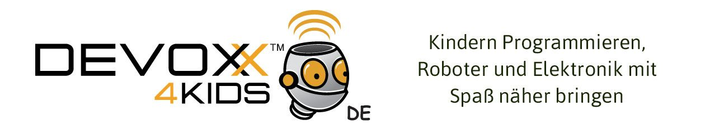

# Workshop für Sonic PI

Dieser Workshop wurde von *Stefan Höhn, Irene Höppner und Matthias Malstädt* zusammengestellt.

Der Workshop wurde für eine Länge von ca. 80-90 Minuten zusammengestellt.

## Anleitung

Der Workshop besteht aus zwei Parts:
 * Dokumentation
 * Sonic Pi Beispiele 

Es ist empfohlen den ganzen Ordner nach c:/ oder /. zu schieben. Der Grund dafür ist das 
einige der Beispiele auf externe Sounds zugreifen, auf welche in dem Code verwiesen wird.

## Dokumentation
Zu Beginn: Die Präsentation ist zurzeit nur auf Deutsch und Englisch verfügbar, aber fühlt 
euch Frei es zu übersetzen.

### Workshop Handout für die Kinder

Die Idee des Workshops basiert auf "Karten" die den Kindern ausgeteilt werden, welche sie nach und nach durchgehen können, während sie von den Mentoren unterstützt werden. Ähnlich wie es 
die D4K Hamburg gemacht hat. Allerdings änderten wir die Reihenfolge und den Kontext in 
welchem sie Trainieren. Auf diesem Weg lernen sie in verschiedenen Bereichen und legen das Wissen in einzelnen Blöcken ab. Zum Schluss Setzen sie alles zu etwas das Funktioniert zusammen,
 während wir die Kinder auch im Laufe des Workshops motiviert halten, Kreativ zu sein
und selbst dabei zu bleiben.

Unsere Absicht ist es im Laufe des Workshops eine Art "Meisterstück" aufzubauen, welches am 
Ende Zusammen gesetzt wurde, was ziemlich cool klingt.

Während der Kreation und den ersten Tests ist uns aufgefallen, dass der Spaß nach den 
ersten zwei bis drei Blöcken zum Vorschein kommt. 

## Vorbereitung

Falls sie ein usb-Sound-Gerät nutzen, müssen sie noch alsa für den raspberrypi konfigurieren:
https://forum-raspberrypi.de/forum/thread/23362-tutorial-mpd-und-usb-soundkarte-unter-raspbian-jessie-einrichten/

## Anleitung

**Vorbereitung**: Man sollte die Folien ausdrucken, diese dann in die Abschnitte der "Karten" und "Spickzettel" einteilen. Die Folien der Karten in zwei Teile schneiden. Wir empfehlen ein Loch durch die Karten zu stanzen und mit einem Faden oder ähnlichem zu verbinden. ( die Luxusvariante wäre die Karten zu laminieren und zusammen zu klammern. )

** Verwendung **:

Die Karten sind in drei Teile aufgeteilt.
* Der Große Bereich beinhaltet hauptsächlich simple Kommandos welche ausprobiert
werden sollten. Meistens ersetzen Sie nur was zuvor da war, aber manchmal müssen auch die Kinder selbst etwas ersetzen oder ändern. Mit der Zeit erwarten wir mehr 
Transfer Wissen, indem wir ein paar Details außen vor lassen. Falls das zu viel ist, sollte der Mentor einspringen und dort mithelfen.
* Darunter ist ein kleiner Satz welcher den groben Hintergrund der Übung erklärt.
* Der untere Bereich bietet alternative Aufgaben, welche genutzt werden können, um die Kreativität anzuregen.
* Wann immer eine Karte mit dem Namen "Buffer" kommt, sollte die Kinder mit dem
nächsten Block in Sonic Pi starten.

Dies könnte mit dem **Ergebnis des Workshops** vergleichbar sein:

```ruby

live_loop :melody do
  sample :guit_em9
  sleep 2
end

live_loop :drums do
  use_bpm 120
  sample :bd_haus
  sleep 1
  sample :sn_zome
  sleep 1
end

live_loop :diddel do
  use_bpm 240
  play scale(:e4, :minor).choose, amp: 2
  sleep 1
end

live_loop :scaleMelody do
  use_bpm 480
  use_synth :piano
  play_pattern scale(:e4, :minor), amp: 1
  play_pattern scale(:e4, :minor).reverse, amp: 1
end

```
## Beispiele

Die Beispiele können in zwei Parts aufgeteilt werden:
1. Beispiele für die Demo, zu Beginn des Workshops
1. Weitere Beispiele für die Mentoren, für die Train-the-mentor Sessions.

**Beispiel für die Demo**

Es gibt besonders ein Beispiel, welches _workshop-intro-demo_ benannt ist. Die Idee ist mehrere live_loops zu haben, welche mehr oder weniger zusammen laufen. Beim Start wird man nichts hören. Es gibt eine main live_loop welche "control" heißt. Sie
enthält flags, die erlauben den Inhalt der live_loops an- und auszuschalten.
Die Absicht der Demo ist nicht den Kindern zu zeigen wie man Sonic Pi nutzt, sondern viel mehr zu zeigen, was man alles mit Sonic Pi machen kann.

Wir Empfehlen
* mit _heartbeat_ zu starten und die Kinder anweisen mit ihren Füßen mit zu stampfen
* Die _claps_ aktivieren und die Kinder anweisen zwei mal auf ihre Knie zu klatschen und einmal mit den Händen. (Btw. erkennt jemand den Beat? ;-) )

Von hier aus kann man den einen oder anderen Song hinzufügen und zusammen Spaß 
haben...
